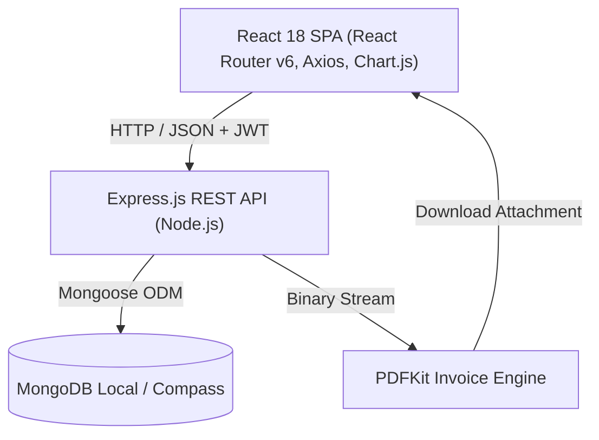

# ElectroTrack WMS — Technical Reference & Architecture Documentation

ElectroTrack WMS (Workforce & Billing Management System) is a full-stack web application designed for electrical contracting businesses, facility managers, and field service teams. It unifies job tracking, electrician dispatch, material inventory, time tracking, customer CRM, company settings, and PDF invoicing into a unified dark glassmorphism dashboard.

---

## 1. System Architecture & Tech Stack



### Core Technologies

| Layer | Technologies |
|---|---|
| **Frontend** | React 18, React Router v6, Axios, React-Toastify, Chart.js / react-chartjs-2, React Icons |
| **Styling** | Vanilla CSS3 (Custom Dark Glassmorphism Design System), Google Inter Font |
| **Backend** | Node.js, Express.js, JWT (jsonwebtoken), bcryptjs, PDFKit, CORS, dotenv |
| **Database** | MongoDB (Mongoose ODM) |
| **Dev Tools** | MongoDB Compass, React Scripts, nodemon |

---

## 2. Directory & File Structure

```
Electrictian-WMS/
├── backend/
│   ├── config/
│   │   └── db.js                 # MongoDB connection handler
│   ├── controllers/
│   │   ├── analyticsController.js # Revenue, job & technician telemetry
│   │   ├── authController.js      # Login, registration, profile & password
│   │   ├── customerController.js  # Customer CRUD operations
│   │   ├── invoiceController.js   # Invoice CRUD + PDFKit streaming engine
│   │   ├── jobController.js       # Work order management & assignments
│   │   ├── materialController.js  # Stock, inventory & site usage
│   │   ├── settingController.js   # Company profile & billing defaults
│   │   ├── timelogController.js   # Check-in / out attendance tracking
│   │   └── userController.js      # Electrician & team member management
│   ├── middleware/
│   │   └── auth.js               # JWT verification & RBAC authorization
│   ├── models/
│   │   ├── Customer.js           # Client CRM model
│   │   ├── Invoice.js            # Billing, items, taxes, charges & payments
│   │   ├── Job.js                # Work orders & site tasks
│   │   ├── Material.js           # Inventory items & valuation
│   │   ├── Settings.js           # Company branding & bank transfer info
│   │   ├── TimeLog.js            # Shift logs & hours
│   │   └── User.js               # Auth users & technician profiles
│   ├── routes/
│   │   ├── analytics.js
│   │   ├── auth.js
│   │   ├── customers.js
│   │   ├── invoices.js
│   │   ├── jobs.js
│   │   ├── materials.js
│   │   ├── settings.js
│   │   ├── timelogs.js
│   │   └── users.js
│   ├── .env                      # Backend environment variables
│   ├── package.json
│   └── server.js                 # Express app initialization & route mounting
├── public/
│   ├── index.html
│   └── manifest.json
├── src/
│   ├── components/
│   │   ├── Analytics/            # Analytics charts & KPI dashboard
│   │   ├── auth/                 # Login & Register split-screen views
│   │   ├── common/               # Shared badges & alert components
│   │   ├── customers/            # CustomerList, CustomerForm, CustomerDetail
│   │   ├── dashboard/            # AdminDashboard & ElectricianDashboard
│   │   ├── electricians/         # ElectricianList & ElectricianForm
│   │   ├── invoices/             # InvoiceList, InvoiceForm, InvoiceView
│   │   ├── jobs/                 # Jobs, JobForm, JobDetails, JobsByElectrician
│   │   ├── layout/               # Sidebar, Home, Navbar
│   │   ├── materials/            # MaterialsList, MaterialForm, Inventory
│   │   ├── profile/              # User profile & credentials management
│   │   ├── routing/              # PrivateRoute & RoleRoute
│   │   ├── settings/             # Company & Billing Settings
│   │   └── timelogs/             # AttendanceReport, TimeLogButton, TimeLogList
│   ├── config/
│   │   └── axios.js              # Global Axios instance with JWT interceptor
│   ├── context/
│   │   └── AuthContext.js        # Global user state & token storage
│   ├── hooks/
│   │   └── useAuth.js            # Custom authentication hook
│   ├── App.css                   # Sidebar, cards, form grids & layout styles
│   ├── App.js                    # Route definition & lazy-loaded pages
│   ├── index.css                 # Dark Glassmorphism design tokens & utilities
│   └── index.js                  # React DOM entry point
├── package.json
└── README.md
```

---

## 3. Database Schema Models (Mongoose)

### 3.1 `Customer` Schema (`backend/models/Customer.js`)
| Field | Type | Required | Description |
|---|---|---|---|
| `name` | String | Yes | Client or representative name |
| `email` | String | No | Contact email address |
| `phone` | String | No | Mobile / WhatsApp contact |
| `address` | String | No | Site or billing address |
| `company` | String | No | Business / trade name |
| `gstin` | String | No | GST Identification Number / Tax ID |
| `notes` | String | No | Internal remarks & preferences |
| `createdBy` | ObjectId (User) | Yes | User who created the customer |

### 3.2 `Invoice` Schema (`backend/models/Invoice.js`)
| Field | Type | Default | Description |
|---|---|---|---|
| `invoiceNumber` | String | Auto | Unique sequential identifier (`INV-YYYY-XXXX`) |
| `job` | ObjectId (Job) | null | Optional reference to linked job |
| `customer` | ObjectId (Customer) | null | Reference to registered customer |
| `client` | Object | `{}` | Fallback embedded client details |
| `items` | Array | `[]` | Line items: `{ description, quantity, unitPrice, total }` |
| `labourCost` | Number | 0 | Dedicated labour charges |
| `materialCost` | Number | 0 | Direct material charges |
| `transportCharge` | Number | 0 | Delivery / site travel fee |
| `serviceCharge` | Number | 0 | Handling or installation fee |
| `otherCharge` | Number | 0 | Custom extra charge |
| `otherChargeLabel` | String | '' | Description of custom charge |
| `discount` | Number | 0 | Discount value |
| `discountType` | String | `'percentage'` | `'percentage'` or `'fixed'` |
| `taxRate` | Number | 18 | GST / Tax percentage |
| `tax` | Number | Auto | Computed tax amount |
| `totalAmount` | Number | Auto | Grand total amount |
| `amountPaid` | Number | 0 | Settlement received |
| `balanceDue` | Number | Auto | Computed outstanding balance |
| `paymentMethod` | String | `'Cash'` | `'Cash'`, `'UPI / QR'`, `'Bank Transfer'`, etc. |
| `transactionId` | String | '' | UTR / Cheque / Reference number |
| `status` | String | `'Draft'` | `'Draft'`, `'Sent'`, `'Partially Paid'`, `'Paid'`, `'Overdue'` |
| `dueDate` | Date | null | Payment due date |
| `notes` | String | '' | Customer notes on invoice |
| `termsAndConditions` | String | '' | Legal terms & conditions printed on invoice |

### 3.3 `Settings` Schema (`backend/models/Settings.js`)
| Field | Type | Default | Description |
|---|---|---|---|
| `user` | ObjectId (User) | Required | Company owner / admin account |
| `companyName` | String | `'ElectroTrack WMS'` | Business name on invoices & header |
| `companyAddress` | String | `''` | Registered office address |
| `companyPhone` | String | `''` | Business telephone number |
| `companyEmail` | String | `''` | Official billing email |
| `companyGstin` | String | `''` | Business Tax ID / GSTIN |
| `defaultTaxRate` | Number | 18 | Default GST rate for new bills |
| `currencySymbol` | String | `'₹'` | Currency symbol (`₹`, `$`, `€`, `£`) |
| `bankName` | String | `''` | Bank for wire/NEFT payments |
| `accountNumber` | String | `''` | Bank account number |
| `ifscCode` | String | `''` | Bank IFSC / routing code |
| `upiId` | String | `''` | VPA / UPI ID for QR code settlement |
| `invoicePrefix` | String | `'INV'` | Invoice numbering prefix |
| `invoiceTerms` | String | Default text | Standard terms printed on PDF exports |

### 3.4 `Job` Schema (`backend/models/Job.js`)
| Field | Type | Required | Description |
|---|---|---|---|
| `title` | String | Yes | Work order title |
| `description` | String | No | Scope of work & instructions |
| `location` | String | No | Physical site location |
| `status` | String | No | `'Not Started'`, `'In Progress'`, `'Completed'`, `'Cancelled'` |
| `priority` | String | No | `'low'`, `'medium'`, `'high'` |
| `startDate` | Date | Yes | Scheduled start date |
| `dueDate` | Date | No | Target completion date |
| `client` | Object | No | Embedded client name, phone, email, address |
| `assignedTo` | Array of ObjectIds | No | Assigned electrician users |

### 3.5 `Material` Schema (`backend/models/Material.js`)
| Field | Type | Description |
|---|---|---|
| `name` | String | Part or consumable name |
| `category` | String | Category (Wiring, Lighting, Breakers, Tools) |
| `quantity` | Number | Current stock level |
| `unitPrice` | Number | Cost per unit |
| `unit` | String | Unit of measurement (meters, pcs, boxes) |
| `supplier` | String | Vendor / Supplier name |
| `minStock` | Number | Threshold for low stock warnings |

### 3.6 `TimeLog` Schema (`backend/models/TimeLog.js`)
| Field | Type | Description |
|---|---|---|
| `user` | ObjectId (User) | Electrician logging time |
| `job` | ObjectId (Job) | Associated job assignment |
| `checkIn` | Date | Start timestamp |
| `checkOut` | Date | End timestamp |
| `hoursWorked` | Number | Calculated elapsed duration |
| `notes` | String | Field log details |

---

## 4. REST API Documentation

Base URL: `http://localhost:5000/api`

### Authentication (`/api/auth`)
| Method | Endpoint | Access | Description |
|---|---|---|---|
| `POST` | `/api/auth/register` | Public | Create new admin/electrician account |
| `POST` | `/api/auth/login` | Public | Sign in and return JWT token |
| `GET` | `/api/auth/me` | Private | Retrieve current user profile |
| `PUT` | `/api/auth/updatedetails` | Private | Update name, phone, specialization |
| `PUT` | `/api/auth/updatepassword` | Private | Change user password |

### Customers (`/api/customers`)
| Method | Endpoint | Access | Description |
|---|---|---|---|
| `GET` | `/api/customers` | Private | List all customers with search & pagination |
| `GET` | `/api/customers/:id` | Private | Get customer details with billing history |
| `POST` | `/api/customers` | Private | Create new customer |
| `PUT` | `/api/customers/:id` | Private | Update customer information |
| `DELETE` | `/api/customers/:id` | Admin | Delete customer record |

### Invoices (`/api/invoices`)
| Method | Endpoint | Access | Description |
|---|---|---|---|
| `GET` | `/api/invoices` | Private | List invoices (filters: `status`, `customer`, `job`) |
| `GET` | `/api/invoices/:id` | Private | Get single invoice by ID |
| `POST` | `/api/invoices` | Admin | Create invoice with items, charges & discounts |
| `PUT` | `/api/invoices/:id` | Admin | Update invoice & payment details |
| `DELETE` | `/api/invoices/:id` | Admin | Delete invoice |
| `GET` | `/api/invoices/:id/pdf` | Private | **Stream generated branded PDF invoice** |

### Settings (`/api/settings`)
| Method | Endpoint | Access | Description |
|---|---|---|---|
| `GET` | `/api/settings` | Private | Fetch user's company profile & billing defaults |
| `PUT` | `/api/settings` | Private | Update company details, bank info, and tax rate |

### Jobs (`/api/jobs`)
| Method | Endpoint | Access | Description |
|---|---|---|---|
| `GET` | `/api/jobs` | Private | List jobs (filters: `status`, `priority`, `page`) |
| `GET` | `/api/jobs/:id` | Private | Get job details with team & timelogs |
| `POST` | `/api/jobs` | Admin | Create work order and assign electricians |
| `PUT` | `/api/jobs/:id` | Admin | Update job specifications |
| `PUT` | `/api/jobs/:id/status` | Private | Quick status update (for electricians on site) |
| `DELETE` | `/api/jobs/:id` | Admin | Delete job |

### Materials & Inventory (`/api/materials`)
| Method | Endpoint | Access | Description |
|---|---|---|---|
| `GET` | `/api/materials` | Private | Get full parts inventory with total valuation |
| `GET` | `/api/materials/:id` | Private | Get single material |
| `POST` | `/api/materials` | Admin | Add new material SKU |
| `PUT` | `/api/materials/:id` | Admin | Update quantity, price, or details |
| `DELETE` | `/api/materials/:id` | Admin | Remove material from catalog |

### Analytics & Reports (`/api/analytics`, `/api/reports`)
| Method | Endpoint | Access | Description |
|---|---|---|---|
| `GET` | `/api/analytics` | Admin | Monthly revenue trend, job distribution, KPI cards |
| `GET` | `/api/reports/attendance` | Admin | Electrician check-in/out attendance report |

---

## 5. Frontend Route Map & Roles

| Route Path | Component | Allowed Roles | Description |
|---|---|---|---|
| `/` | `Home.js` | Public | Landing page with hero & feature highlights |
| `/login` | `Login.js` | Public | Split-screen authentication |
| `/register` | `Register.js` | Public | Account creation |
| `/dashboard` | `Dashboard.js` | Authenticated | Role-aware dashboard (Admin / Electrician) |
| `/profile` | `Profile.js` | Authenticated | Account preferences & profile photo badge |
| `/jobs` | `Jobs.js` | Authenticated | Searchable card grid of work orders |
| `/jobs/:id` | `JobDetails.js` | Authenticated | Job overview, team, status, timelogs & materials |
| `/jobs/create` | `JobForm.js` | Admin | Work order builder with customer auto-fill |
| `/jobs/:id/edit` | `JobForm.js` | Admin | Edit work order |
| `/customers` | `CustomerList.js` | Admin | Customer directory with direct billing trigger |
| `/customers/create`| `CustomerForm.js` | Admin | Add new customer record |
| `/customers/:id` | `CustomerDetail.js` | Admin | Profile, metrics, and customer invoices |
| `/customers/:id/edit`| `CustomerForm.js`| Admin | Update customer contact info |
| `/invoices` | `InvoiceList.js` | Admin | Billing table, revenue metrics, PDF downloads |
| `/invoices/create` | `InvoiceForm.js` | Admin | Multi-charge billing form with calculations |
| `/invoices/:id` | `InvoiceView.js` | Admin | Preview, print, and PDF export page |
| `/invoices/:id/edit`| `InvoiceForm.js` | Admin | Modify invoice line items & payments |
| `/materials` | `MaterialsList.js`| Admin, Electrician| Stock inventory with search & low stock badges |
| `/materials/create`| `MaterialForm.js` | Admin | Add new inventory SKU |
| `/electricians` | `ElectricianList.js`| Admin | Technician cards with specializations |
| `/analytics` | `Analytics.js` | Admin | Interactive Chart.js graphs & KPI cards |
| `/settings` | `Settings.js` | Admin | Company profile, tax rates & bank account details |

---

## 6. Design System Tokens (`index.css`)

```css
:root {
  /* Surface Layers */
  --bg:            #0a0b0f;
  --bg-elevated:   #0f1117;
  --bg-card:       rgba(255, 255, 255, 0.04);
  --bg-card-hover: rgba(255, 255, 255, 0.07);
  --bg-input:      rgba(255, 255, 255, 0.06);

  /* Primary Brand */
  --primary:       #6366f1; /* Indigo */
  --primary-hover: #818cf8;
  --primary-dim:   rgba(99, 102, 241, 0.15);
  --primary-glow:  rgba(99, 102, 241, 0.35);

  /* Accents */
  --accent:        #22d3ee; /* Cyan */
  --accent-dim:    rgba(34, 211, 238, 0.15);
  --success:       #10b981; /* Emerald */
  --warning:       #f59e0b; /* Amber */
  --danger:        #ef4444; /* Rose */
  --purple:        #a855f7; /* Violet */

  /* Typography */
  --text:          #e2e8f0;
  --text-muted:    #94a3b8;
  --text-dim:      #475569;

  /* Layout */
  --sidebar-width:     256px;
  --sidebar-collapsed: 70px;
  --radius:            12px;
  --radius-sm:         8px;
  --radius-lg:         16px;
}
```

---

## 7. Setup & Run Instructions

### Prerequisites
1. **Node.js** (v16+ recommended)
2. **MongoDB** running locally on `mongodb://localhost:27017/electrician-wms` (or MongoDB Compass)

### Environment Configuration

Create `backend/.env`:
```env
PORT=5000
NODE_ENV=development
MONGO_URI=mongodb://localhost:27017/electrician-wms
JWT_SECRET=electrotrack_secret_jwt_key_2026
JWT_EXPIRE=30d
```

### Starting the Servers

#### 1. Backend Server
```bash
cd backend
npm install
node server.js
# Output: ✓ ElectroTrack API running on port 5000
# Output: MongoDB Connected: localhost
```

#### 2. Frontend Application
```bash
cd ..
npm install
npm start
# App opens automatically at http://localhost:3000
```

### Default Admin Credentials
* **Email**: `admin@company.com`
* **Password**: `password123`

---

## 8. Summary of Major Features Imported from `NewElectric`

1. **Dedicated Customer Directory (`/customers`)**: Full client CRM supporting addresses, GSTIN numbers, contact details, and customer-specific billing history.
2. **Itemized Billing Engine (`/invoices/create`)**: Dynamic line items, labour cost, direct material expenses, transport charges, service charges, other custom charges, and percentage/fixed discounts.
3. **Server-Side PDF Invoicing (`/api/invoices/:id/pdf`)**: Direct binary PDF export featuring company branding, tax registration, client details, payment terms, and bank transfer metadata.
4. **Company & Billing Settings (`/settings`)**: Configurable business profile, default GST rates, invoice numbering prefix, and bank/UPI accounts.
5. **Settlement & Payment Tracking**: Supports partial payments, balance calculation, payment methods (Cash, UPI, NEFT, Cheque), and transaction UTR reference tracking.
